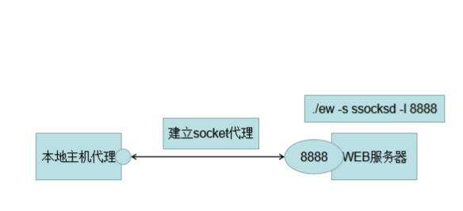

### 两层网络

##### 本地监听

目标机器  ： ./ew -s ssocksd -l 8888

### 三层网络

#### 反向

> #监听本地8888端口转发到1080
>
> ./ew -s rcsocks -l 1080 -e 8888
>
> #反弹到8888端口
>
> ./ew -s rssocks -d 1.1.1.1 -e 8888

#### 正向

> #正向连接9999端口并转发到本地1080端口
>
> ./ew -s lcx_tran -l 1080 -f 2.2.2.3 -g 9999
>
> #本地监听9999端口
>
> ./ew -s ssocksd -l 9999

### 四层网络

> ./ew -s lcx_listen -l 1080 -e 8888
>
> ./ew -s lcx_slave -d 1.1.1.1 -e 8888 -f 2.2.2.3 -g 9999
>
> ./ew -s ssocksd -l 9999